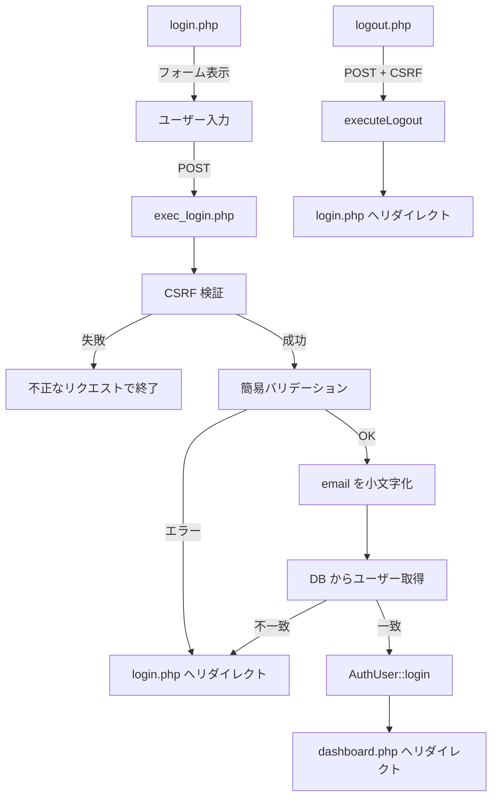

# ログイン機能 Laravel 移植計画

元の PHP システム（[login](https://github.com/yumyum-02/login)）のログイン機能を、Laravel プロジェクト（login-laravel）に当てはめるための設計書です。

対象範囲は README.md に記載の **ログイン** 機能と、ログイン成功後に遷移する **ダッシュボード**、および **ログアウト** です。

---

## 目次

1. [元システムの処理フロー](#1-元システムの処理フロー)
2. [PHP → Laravel 対応表](#2-php--laravel-対応表)
3. [Laravel での処理フロー](#3-laravel-での処理フロー)
4. [実装手順](#4-実装手順)
5. [作成・変更するファイル一覧](#5-作成変更するファイル一覧)
6. [各ファイルの役割と実装内容](#6-各ファイルの役割と実装内容)
7. [データベース](#7-データベース)
8. [バリデーション](#8-バリデーション)
9. [認証・セッション](#9-認証セッション)
10. [セキュリティ対策の対応](#10-セキュリティ対策の対応)
11. [ルーティング](#11-ルーティング)
12. [画面（Blade）](#12-画面blade)
13. [テスト観点](#13-テスト観点)

---

## 1. 元システムの処理フロー



### 元システムの関連ファイル

| 役割 | ファイル |
|------|----------|
| ログイン画面表示 | `public/login.php` |
| ログイン処理 | `public/exec_login.php` |
| ログアウト処理 | `public/logout.php` |
| ダッシュボード | `public/admin/dashboard.php` |
| 認証クラス | `src/Auth/AuthUser.php` |
| バリデーション | `src/functions/validation.php` |
| 簡易バリデーション | `src/functions/validation-error.php` |
| DB 操作 | `src/functions/db.php`（`getUserLogin`） |
| CSRF | `src/functions/csrf.php` |
| リダイレクト | `src/functions/redirect.php` |
| セッションメッセージ | `src/functions/session-message.php` |
| ログアウト | `src/functions/logout.php` |
| XSS 対策 | `src/functions/sanitize.php` |
| 共通初期化 | `src/bootstrap.php` |
| ログイン画面 | `src/template/login_template.php` |
| ダッシュボード画面 | `src/template/dashboard_template.php` |
| ナビゲーション | `src/template/components/navbar.php` |
| サイドバー | `src/template/components/sidebar.php` |

---

## 2. PHP → Laravel 対応表

| 元 PHP | Laravel での置き換え |
|--------|---------------------|
| `AuthUser::login()` / `$_SESSION['user']` | `Auth::login($user)` + Laravel セッション認証 |
| `AuthUser::isLogin()` | `Auth::check()` |
| `AuthUser::getUser()` / `getName()` 等 | `Auth::user()` / `auth()->user()->name` |
| `AuthUser::requireLogin()` | `auth` ミドルウェア |
| `AuthUser::logout()` | `Auth::logout()` |
| `getUserLogin($email)` | `User::where('email', $email)->first()` |
| `password_verify()` | `Hash::check()` または `Auth::attempt()` |
| `generateCsrfToken()` / `requireValidCsrfToken()` | `@csrf` + `VerifyCsrfToken` ミドルウェア（標準） |
| `redirect('./login.php')` | `redirect()->route('login')` |
| `$_SESSION['error_message']` | `session()->flash('error_message', ...)` |
| `$_SESSION['msg']` | `session()->flash('msg', ...)` |
| `escape($value)` | Blade の `{{ $value }}`（自動エスケープ） |
| `session_regenerate_id()` | `session()->regenerate()`（ログイン・ログアウト時） |
| `login.php` + `login_template.php` | `LoginController@create` + `auth/login.blade.php` |
| `exec_login.php` | `LoginController@store` |
| `logout.php` | `LoginController@destroy` |
| `dashboard.php` + `dashboard_template.php` | `DashboardController@index` + `dashboard/index.blade.php` |

---

## 3. Laravel での処理フロー

```mermaid
graph TD
    A[GET /login] --> B[LoginController@create]
    B --> C[auth/login.blade.php]

    D[POST /login] --> E[LoginController@store]
    E --> F[LoginRequest バリデーション]
    F -->|失敗| G[login へリダイレクト + エラー]
    F -->|成功| H[email 小文字化]
    H --> I[Auth::attempt]
    I -->|失敗| G
    I -->|成功| J[session regenerate]
    J --> K[GET /dashboard へリダイレクト]

    L[POST /logout] --> M[LoginController@destroy]
    M --> N[Auth::logout + session regenerate]
    N --> O[login へリダイレクト]

    P[GET /dashboard] --> Q[auth ミドルウェア]
    Q -->|未ログイン| R[login へリダイレクト]
    Q -->|ログイン済| S[DashboardController@index]
```

---

## 4. 実装手順

[first-step.md](./first-step.md) の初期設定が完了していることを前提に、以下の順序で進める。  
各ファイルの詳細は [5. 作成・変更するファイル一覧](#5-作成変更するファイル一覧) と [6. 各ファイルの役割と実装内容](#6-各ファイルの役割と実装内容) を参照。

1. **環境設定**
   - `.env` に MAMP の MySQL 接続（`login_db_laravel`）を設定

2. **DB マイグレーション**
   - 未 `migrate` 時: `0001_01_01_000000_create_users_table.php` に `icon` カラムを追加
   - 済みの場合: `php artisan make:migration add_icon_to_users_table` で追加マイグレーションを作成
   - `php artisan migrate` を実行

3. **Seeder**
   - `database/seeders/DatabaseSeeder.php` にテストユーザーを追加
   - `php artisan db:seed` を実行

4. **モデル**
   - `app/Models/User.php` の `fillable` に `icon` を追加

5. **バリデーション**
   - `php artisan make:rule PasswordFormat` でルール作成
   - `php artisan make:request Auth/LoginRequest` で Form Request 作成

6. **コントローラ**
   - `php artisan make:controller Auth/LoginController` を作成
   - `php artisan make:controller DashboardController` を作成

7. **ルート**
   - `routes/web.php` にログイン・ログアウト・ダッシュボードのルートを定義

8. **ミドルウェア（任意）**
   - `bootstrap/app.php` で未ログイン時のリダイレクト先を `/login` に設定

9. **ビュー**
   - `resources/views/layouts/app.blade.php` を作成
   - `resources/views/components/navbar.blade.php` を作成
   - `resources/views/components/sidebar.blade.php` を作成
   - `resources/views/auth/login.blade.php` を作成
   - `resources/views/dashboard/index.blade.php` を作成
   - `public/css/style.css` を必要に応じてコピー

10. **動作確認**
    - 正常ログイン → ダッシュボード表示
    - ログアウト → ログイン画面へ
    - バリデーションエラー・認証失敗で同一メッセージ
    - 未ログインで `/dashboard` アクセス → ログインへリダイレクト
    - 大文字混じりメールアドレスでログイン可能
    - 詳細は [13. テスト観点](#13-テスト観点) を参照

---

## 5. 作成・変更するファイル一覧

依存関係を考慮し、**作成・変更する順番**で並べています。  
[first-step.md](./first-step.md) の初期設定（`.env` 作成・`migrate` など）が完了していることを前提とします。

| # | ファイル | 種別 | 役割 | 作成コマンド（参考） |
|---|----------|------|------|---------------------|
| 1 | `.env` | 変更 | MySQL 接続（`login_db_laravel`） | — |
| 2a | `database/migrations/0001_01_01_000000_create_users_table.php` | 変更 | 未マイグレーション時: `icon` カラムを含めて定義 | — |
| 2b | `database/migrations/xxxx_xx_xx_add_icon_to_users_table.php` | 新規 | マイグレーション済み時: `icon` カラムを追加 | `php artisan make:migration add_icon_to_users_table` |
| 3 | `database/seeders/DatabaseSeeder.php` | 変更 | テストユーザー 1 件を登録 | — |
| 4 | `app/Models/User.php` | 変更 | `icon` を `fillable` に追加 | — |
| 5 | `app/Rules/PasswordFormat.php` | 新規 | パスワード形式チェック（元 `isPasswordFormat`） | `php artisan make:rule PasswordFormat` |
| 6 | `app/Http/Requests/Auth/LoginRequest.php` | 新規 | ログイン入力バリデーション | `php artisan make:request Auth/LoginRequest` |
| 7 | `app/Http/Controllers/Auth/LoginController.php` | 新規 | ログイン・ログアウト | `php artisan make:controller Auth/LoginController` |
| 8 | `app/Http/Controllers/DashboardController.php` | 新規 | ダッシュボード表示 | `php artisan make:controller DashboardController` |
| 9 | `routes/web.php` | 変更 | ログイン・ログアウト・ダッシュボードのルート定義 | — |
| 10 | `bootstrap/app.php` | 変更 | 未ログイン時のリダイレクト先を `route('login')` に設定（任意） | — |
| 11 | `resources/views/layouts/app.blade.php` | 新規 | 共通レイアウト（Bootstrap 5） | — |
| 12 | `resources/views/components/navbar.blade.php` | 新規 | ナビゲーション（元 `navbar.php`） | — |
| 13 | `resources/views/components/sidebar.blade.php` | 新規 | サイドバー（元 `sidebar.php`） | — |
| 14 | `resources/views/auth/login.blade.php` | 新規 | ログイン画面 | — |
| 15 | `resources/views/dashboard/index.blade.php` | 新規 | ダッシュボード画面 | — |
| 16 | `public/css/style.css` | 新規 | 元システムのスタイル（必要に応じてコピー） | — |

> **#2 について:** `migrate` 前なら **2a** で `icon` を含めて定義。既に `migrate` 済みなら **2b** の追加マイグレーションのみ作成する。  
> **#2〜4 の後:** `php artisan migrate`（2b の場合）→ `php artisan db:seed` で DB を準備する。

### 作成不要（Laravel 標準で代替）

| 元 PHP | 理由 |
|--------|------|
| `src/functions/csrf.php` | `VerifyCsrfToken` ミドルウェア + `@csrf` |
| `src/functions/sanitize.php` | Blade 自動エスケープ |
| `src/functions/db.php`（ログイン部分） | Eloquent `User` モデル |
| `src/Auth/AuthUser.php` | Laravel Auth |
| `src/bootstrap.php` | Laravel 起動処理 |

---

## 6. 各ファイルの役割と実装内容

セクション 5 の番号順に記載しています。

### 6.1 `.env`（#1）

MySQL 接続を設定する（詳細は [first-step.md](./first-step.md) および [7.3](#73-env-設定) 参照）。

---

### 6.2 マイグレーション（#2a / #2b）

`users` テーブルに `icon` カラムを用意する（詳細は [7.2](#72-laravel-マイグレーションとの差分) 参照）。

---

### 6.3 `database/seeders/DatabaseSeeder.php`（#3）

開発用テストユーザーを登録する（詳細は [7.4](#74-初期データ) 参照）。

---

### 6.4 `app/Models/User.php`（#4）

元の `users` テーブルに対応。Laravel 標準の `Authenticatable` を継続利用。

**追加・確認事項:**

```php
// fillable に icon を追加（将来のアカウント編集用。ログイン自体では未使用）
protected $fillable = ['name', 'email', 'password', 'icon'];

// password は 'hashed' キャスト済み → Hash::make 不要
```

**メールアドレスの小文字化:**

元システムは照合前に `mb_strtolower` する。Laravel では以下のいずれかで対応:

- **推奨:** `LoginController@store` で小文字化してから `Auth::attempt`
- **追加対応（任意）:** `User` モデルに `setEmailAttribute` で保存時も小文字化（会員登録実装時に有効）

---

### 6.5 `app/Rules/PasswordFormat.php`（#5）

元の `isPasswordFormat()` を再現。

```php
// 正規表現: /^[a-zA-Z0-9!@#$%^&*()\-_+=]+$/
```

`LoginRequest` の `password` ルールで `new PasswordFormat` を使用。

---

### 6.6 `app/Http/Requests/Auth/LoginRequest.php`（#6）

元の `getSimpleEmailErrors` / `getSimplePasswordErrors` に相当。

**入力取得:**

| 項目 | 元 PHP | Laravel |
|------|--------|---------|
| email | `getTrimmedPostValue('email')` | `$this->input('email')` を trim |
| password | `$_POST['password'] ?? ''`（trim なし） | `$this->input('password')`（trim なし） |

**バリデーションルール（元の簡易版に合わせる）:**

| 項目 | 条件 | エラー時の扱い |
|------|------|----------------|
| email | 必須・メール形式・320 文字以内 | 統一メッセージ「ログイン情報が正しくありません。」 |
| password | 必須・半角英数字と記号・8〜64 文字 | 同上 |

> 注: 元の `validation-error.php` では簡易版は詳細エラーを出さず、フィールド別エラーもセッションに保存せず、一律 `error_message` のみ表示する設計。Laravel でも `failedValidation` をオーバーライドし、バリデーション失敗時は `error_message` のみ flash してリダイレクトする。

```php
protected function failedValidation(Validator $validator): void
{
    throw new HttpResponseException(
        redirect()->route('login')
            ->with('error_message', 'ログイン情報が正しくありません。')
            ->withInput($this->only('email'))
    );
}
```

---

### 6.7 `app/Http/Controllers/Auth/LoginController.php`（#7）

元の `login.php` + `exec_login.php` + `logout.php` に相当。

```php
// 主なメソッド

public function create(): View
// - ログイン済みなら dashboard へリダイレクト
// - セッションの msg / error_message をビューへ渡す（flash）

public function store(LoginRequest $request): RedirectResponse
// - LoginRequest でバリデーション
// - email を mb_strtolower で小文字化
// - Auth::attempt(['email' => $email, 'password' => $password])
// - 成功: session()->regenerate() → dashboard へ
// - 失敗: flash('error_message', 'ログイン情報が正しくありません。') → login へ

public function destroy(Request $request): RedirectResponse
// - Auth::logout()
// - $request->session()->invalidate()
// - $request->session()->regenerateToken()
// - flash('msg', 'ログアウトしました。') → login へ
```

**元コードとの対応:**

| 元 | Laravel |
|----|---------|
| `login.php` の CSRF 生成 | `@csrf`（フォーム内） |
| `exec_login.php` の `requireValidCsrfToken()` | ミドルウェアが自動検証 |
| `exec_login.php` の `getUserLogin` + `password_verify` | `Auth::attempt()` |
| `AuthUser::login([...])` | `Auth::attempt()` が内部で実施 |
| `executeLogout()` | `Auth::logout()` + セッション再生成 |

---

### 6.8 `app/Http/Controllers/DashboardController.php`（#8）

元の `public/admin/dashboard.php` に相当。

```php
public function index(): View
// - auth ミドルウェアで保護
// - auth()->user()->name をビューへ渡す
// - 「ようこそ、{name}さん ログインに成功しました」を表示
```

---

### 6.9 `routes/web.php`（#9）

```php
Route::middleware('guest')->group(function () {
    Route::get('/login', [LoginController::class, 'create'])->name('login');
    Route::post('/login', [LoginController::class, 'store']);
});

Route::middleware('auth')->group(function () {
    Route::get('/dashboard', [DashboardController::class, 'index'])->name('dashboard');
    Route::post('/logout', [LoginController::class, 'destroy'])->name('logout');
});

Route::redirect('/', '/login');
```

**元 URL との対応:**

| 元 | Laravel |
|----|---------|
| `/login.php` | `/login` |
| `/exec_login.php` | `POST /login` |
| `/logout.php` | `POST /logout` |
| `/admin/dashboard.php` | `/dashboard` |

---

### 6.10 `bootstrap/app.php`（#10・任意）

未ログイン時のリダイレクト先をログイン画面に統一する場合:

```php
->withMiddleware(function (Middleware $middleware): void {
    $middleware->redirectGuestsTo('/login');
})
```

---

### 6.11 `resources/views/layouts/app.blade.php`（#11）

各画面の HTML 骨格。Bootstrap 5 を CDN で読み込む（詳細は [12.3](#123-共通コンポーネント) 参照）。

---

### 6.12 `resources/views/components/navbar.blade.php`（#12）

元の `navbar.php` に相当。ログイン機能のみならアイコン表示は簡略化可。

---

### 6.13 `resources/views/components/sidebar.blade.php`（#13）

元の `sidebar.php` に相当。ログアウトフォーム（POST + `@csrf`）を含む（詳細は [12.4](#124-ログアウトフォームサイドバー内) 参照）。

---

### 6.14 `resources/views/auth/login.blade.php`（#14）

元の `login_template.php` を Blade 化（詳細は [12.1](#121-resourcesviewsauthloginbladephp) 参照）。

---

### 6.15 `resources/views/dashboard/index.blade.php`（#15）

元の `dashboard_template.php` を Blade 化（詳細は [12.2](#122-resourcesviewsdashboardindexbladephp) 参照）。

---

### 6.16 `public/css/style.css`（#16）

元システムの `public/css/style.css` を必要に応じてコピーする。

---

## 7. データベース

### 7.1 テーブル定義（README.md 準拠）

```sql
CREATE TABLE users (
  id INT AUTO_INCREMENT PRIMARY KEY,
  name VARCHAR(255) NOT NULL,
  email VARCHAR(255) NOT NULL UNIQUE,
  password VARCHAR(255) NOT NULL,
  icon VARCHAR(255) NULL,
  created_at TIMESTAMP DEFAULT CURRENT_TIMESTAMP
);
```

### 7.2 Laravel マイグレーションとの差分

デフォルトの `0001_01_01_000000_create_users_table.php` には以下が追加されている:

- `email_verified_at`（未使用なら nullable のまま放置可）
- `remember_token`（Remember Me 未実装なら未使用）
- `updated_at`（元 DB にはないが Laravel 標準として残してよい）

**追加マイグレーション例:**

```php
Schema::table('users', function (Blueprint $table) {
    $table->string('icon')->nullable()->after('password');
});
```

### 7.3 `.env` 設定

MAMP を使う場合（詳細は [first-step.md](./first-step.md) 参照）:

```env
DB_CONNECTION=mysql
DB_HOST=127.0.0.1
DB_PORT=8889
DB_DATABASE=login_db_laravel
DB_USERNAME=root
DB_PASSWORD=root
```

> `DB_PORT` と `DB_PASSWORD` は MAMP の Preferences で確認した値に合わせる。

### 7.4 初期データ

開発用に Seeder でテストユーザーを 1 件作成しておくと動作確認しやすい。

```php
User::create([
    'name' => 'テストユーザー',
    'email' => 'test@example.com',
    'password' => 'password1234',  // hashed キャストで自動ハッシュ化
]);
```

---

## 8. バリデーション

### 8.1 元システムの簡易バリデーション（実装コード準拠）

元の `validation-error.php` の `getSimpleEmailErrors` / `getSimplePasswordErrors`:

| 項目 | チェック内容 | 統一エラーメッセージ |
|------|-------------|---------------------|
| email | 空でない / メール形式 / 320 文字以内 | ログイン情報が正しくありません。 |
| password | 空でない / 半角英数字と記号 / 8〜64 文字 | ログイン情報が正しくありません。 |

### 8.2 Laravel でのルール例

```php
public function rules(): array
{
    return [
        'email' => ['required', 'string', 'email', 'max:320'],
        'password' => ['required', 'string', 'min:8', 'max:64', new PasswordFormat],
    ];
}
```

バリデーション失敗時・認証失敗時ともに **同じメッセージ** を表示する（ユーザー列挙攻撃対策）。

### 8.3 メールアドレス正規化

```php
$email = mb_strtolower(trim($request->input('email')), 'UTF-8');
```

`Auth::attempt` の前に実行する。

---

## 9. 認証・セッション

### 9.1 ログイン処理

```php
if (Auth::attempt(['email' => $email, 'password' => $password], remember: false)) {
    $request->session()->regenerate();
    return redirect()->route('dashboard');
}

return redirect()->route('login')
    ->with('error_message', 'ログイン情報が正しくありません。')
    ->withInput($request->only('email'));
```

- `Auth::attempt` が `password_verify` 相当の照合を行う
- 成功時に `session()->regenerate()` で元の `session_regenerate_id()` に相当

### 9.2 ログアウト処理

```php
Auth::logout();
$request->session()->invalidate();
$request->session()->regenerateToken();

return redirect()->route('login')
    ->with('msg', 'ログアウトしました。');
```

### 9.3 ログイン必須ページ

```php
Route::middleware('auth')->group(function () {
  // ...
});
```

未ログイン時は自動的に `/login` へリダイレクト（`bootstrap/app.php` でカスタマイズ可能）。

### 9.4 セッションに保持する情報

| 元 `$_SESSION['user']` | Laravel |
|------------------------|---------|
| id | `auth()->id()` |
| name | `auth()->user()->name` |
| email | `auth()->user()->email` |

---

## 10. セキュリティ対策の対応

| 対策 | 元 PHP | Laravel |
|------|--------|---------|
| CSRF | `csrf.php` | `web` ミドルウェアグループ + `@csrf` |
| XSS | `escape()` | Blade `{{ }}` |
| SQL インジェクション | PDO プリペアド | Eloquent / クエリビルダ |
| パスワードハッシュ | `password_hash` / `password_verify` | `bcrypt`（`hashed` キャスト） |
| セッション固定化対策 | `session_regenerate_id()` | `session()->regenerate()` |
| ユーザー列挙対策 | 認証失敗・バリデーション失敗で同一メッセージ | 同様に統一メッセージ |
| エラーメッセージ | `$_SESSION['error_message']` | `session()->flash('error_message')` |

---

## 11. ルーティング

| メソッド | URI | 名前 | コントローラ | ミドルウェア | 元ファイル |
|----------|-----|------|-------------|-------------|-----------|
| GET | `/login` | `login` | `LoginController@create` | `guest` | `login.php` |
| POST | `/login` | — | `LoginController@store` | `guest` | `exec_login.php` |
| POST | `/logout` | `logout` | `LoginController@destroy` | `auth` | `logout.php` |
| GET | `/dashboard` | `dashboard` | `DashboardController@index` | `auth` | `admin/dashboard.php` |
| GET | `/` | — | `/login` へリダイレクト | — | `index.php` 相当 |

---

## 12. 画面（Blade）

### 12.1 `resources/views/auth/login.blade.php`

元の `login_template.php` を Blade 化。

**表示要素:**

- タイトル「ログイン」
- 成功メッセージ（`session('msg')`）— 会員登録後・ログアウト後など
- エラーメッセージ（`session('error_message')`）
- email 入力（`old('email')` で再表示）
- password 入力（再表示しない）
- ログインボタン
- 会員登録リンク（`/register` — 今回のスコープ外、リンクのみ先行配置可）
- `@csrf`

**フォーム:**

```blade
<form action="{{ route('login') }}" method="post">
    @csrf
    ...
</form>
```

### 12.2 `resources/views/dashboard/index.blade.php`

元の `dashboard_template.php` を Blade 化。

**表示要素:**

- ナビゲーション（`x-navbar`）
- サイドバー（`x-sidebar`、active: `dashboard`）
- 「ようこそ、{{ auth()->user()->name }}さん」
- 「ログインに成功しました」

### 12.3 共通コンポーネント

| Blade | 元 PHP | 備考 |
|-------|--------|------|
| `layouts/app.blade.php` | 各 template の HTML 骨格 | Bootstrap 5 CDN |
| `components/navbar.blade.php` | `navbar.php` | ログイン機能のみならアイコン表示は簡略化可 |
| `components/sidebar.blade.php` | `sidebar.php` | ログアウトフォーム（POST + @csrf）を含む |

### 12.4 ログアウトフォーム（サイドバー内）

元システムは `logout.php` へ POST。Laravel では:

```blade
<form action="{{ route('logout') }}" method="post">
    @csrf
    <button type="submit">ログアウト</button>
</form>
```

---

## 13. テスト観点

### 正常系

| ケース | 期待結果 |
|--------|----------|
| 正しい email / password | `/dashboard` へリダイレクト、「ようこそ、{name}さん」表示 |
| `Test@Example.com` で登録済みメール | 小文字化後ログイン成功 |

### 異常系

| ケース | 期待結果 |
|--------|----------|
| email 空欄 | 「ログイン情報が正しくありません。」 |
| email 形式不正 | 同上 |
| password 空欄 | 同上 |
| 存在しない email | 同上 |
| password 不一致 | 同上 |
| CSRF トークン不正 | 419 エラー（Laravel 標準） |
| 未ログインで `/dashboard` | `/login` へリダイレクト |

### セキュリティ

| ケース | 期待結果 |
|--------|----------|
| ログイン成功後 | セッション ID が再生成される |
| ログアウト後 | セッションが無効化される |
| パスワード | DB に平文で保存されない |

---

## 付録: 今回のスコープ外

以下は README.md にあるが、ログイン機能の初回移植では **対象外**。後続タスクで実装。

- 会員登録（`regist_template.php` / `exec_register.php`）
- アカウント情報編集（プロフィール・アイコン・メール・パスワード）
- ユーザー一覧・削除（`admin_template.php`）
- Remember Me 機能
- ログイン試行回数制限

---

**作成日:** 2026-06-15
