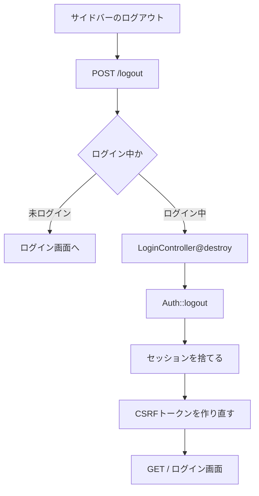
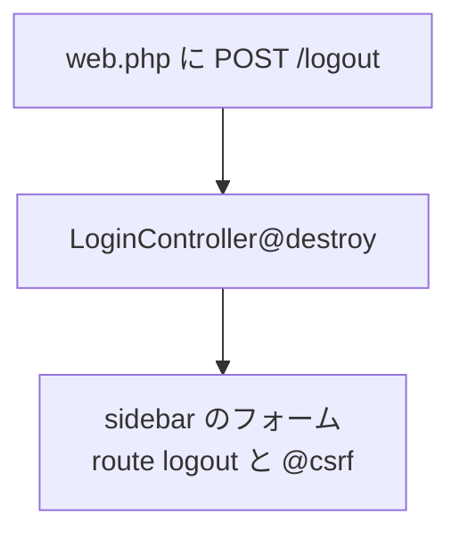

# ログアウト実装メモ（logout ブランチ）

ログインの次に、ログアウト用ルートの接続とサイドバーからの呼び出しを実装した流れをまとめたもの。

前提: [dsc_02-1make-login.md](./dsc_02-1make-login.md) のログインが動いていること。

参考サイト: [Laravel 12.x 日本語ドキュメント（readouble.com）](https://readouble.com/laravel/12.x/ja)

---

## 処理の流れ



上の図は、ログアウトする人が画面を操作したときの動きです。下は、その機能をファイルに書いていく順番です。

## 実装の流れ



---

## 全体の流れ

```
サイドバー「ログアウト」ボタン
  → POST /logout（auth）
  → LoginController@destroy
  → Auth::logout → セッション破棄 → /（ログイン画面）へ
```

| 画面 / 処理 | URL | コントローラー |
|-------------|-----|----------------|
| ログアウト | `POST /logout` | `LoginController@destroy`（名前: `logout`） |

`GET` ではなく `POST` にする。リンク（GET）だと誤クリックや外部サイトからの誘導でログアウトされる恐れがあるため。

---

## 1. なぜエラーになっていたか

サイドバーのフォームが次のようになっていた。

```blade
<form action="" method="post">
  <input type="hidden" name="csrf_token" value="">
  ...
</form>
```

| 問題 | 結果 |
|------|------|
| `action=""` | 今開いているページへ POST する（例: `/dashboard` や `/account`） |
| その URL に POST ルートが無い | `MethodNotAllowedHttpException`（GET しかない、など） |
| 手動の `csrf_token` | Laravel の CSRF チェックに使えない（`@csrf` が必要） |

ログイン時に用意した `LoginController@destroy` はあるが、**ルート未接続**だったので画面から呼べていなかった。

---

## 2. ルート（`routes/web.php`）

参考: [認証 — ログアウト](https://readouble.com/laravel/12.x/ja/authentication.html#logging-out)

```php
Route::post('/logout', [LoginController::class, 'destroy'])
    ->name('logout')
    ->middleware('auth');
```

- `middleware('auth')` … ログイン中の人だけがログアウトできる
- `name('logout')` … Blade から `route('logout')` で呼べる

### 対象コミット

- ログアウトのルート：[0182b8f](https://github.com/yumyum-02/login-laravel/commit/0182b8f0e8375cc1cedde3d484b0c18745f7c341)

---

## 3. コントローラー（`LoginController@destroy`）

参考: [認証 — ログアウト](https://readouble.com/laravel/12.x/ja/authentication.html#logging-out)

```php
public function destroy(Request $request): RedirectResponse
{
    Auth::logout();

    $request->session()->invalidate();
    $request->session()->regenerateToken();

    return redirect('/');
}
```

| 処理 | 意味 |
|------|------|
| `Auth::logout()` | ログイン状態を解除する |
| `session()->invalidate()` | 今のセッションデータを捨てる |
| `session()->regenerateToken()` | CSRF トークンを作り直す |
| `redirect('/')` | ログイン画面へ戻す |

`invalidate` / `regenerateToken` は、ログアウト後に古いセッションが残らないようにするための定石。

### 対象コミット

- `destroy`：[0182b8f](https://github.com/yumyum-02/login-laravel/commit/0182b8f0e8375cc1cedde3d484b0c18745f7c341)

---

## 4. サイドバー（`resources/views/components/sidebar.blade.php`）

```blade
<form action="{{ route('logout') }}" method="post" class="p-2">
  @csrf
  <button type="submit" class="btn btn-outline-danger btn-sm w-100">
    <i class="bi bi-box-arrow-right me-1"></i>ログアウト
  </button>
</form>
```

| 項目 | 変更内容 |
|------|----------|
| 送信先 | `action=""` → `{{ route('logout') }}` |
| CSRF | 手動 hidden → `@csrf` |
| メソッド | `method="post"` のまま（ルートも POST） |

ダッシュボードなど `<x-sidebar>` を置いている画面から、同じボタンでログアウトできる。

### 対象コミット

- サイドバーのログアウトボタン：[0182b8f](https://github.com/yumyum-02/login-laravel/commit/0182b8f0e8375cc1cedde3d484b0c18745f7c341)

---

## 動作確認チェックリスト

- [ ] ログイン後、サイドバーの「ログアウト」を押す → `/`（ログイン画面）へ戻る
- [ ] ログアウト後に `/dashboard` を開く → ログイン画面へ飛び、「ログインしてください」が出る
- [ ] ログアウト後にもう一度ログインできる
- [ ] 未ログインで `POST /logout` → ログイン画面へ（`auth` のため）
- [ ] エラー `MethodNotAllowedHttpException`（POST が account / dashboard に飛ぶ）が出ない

---
