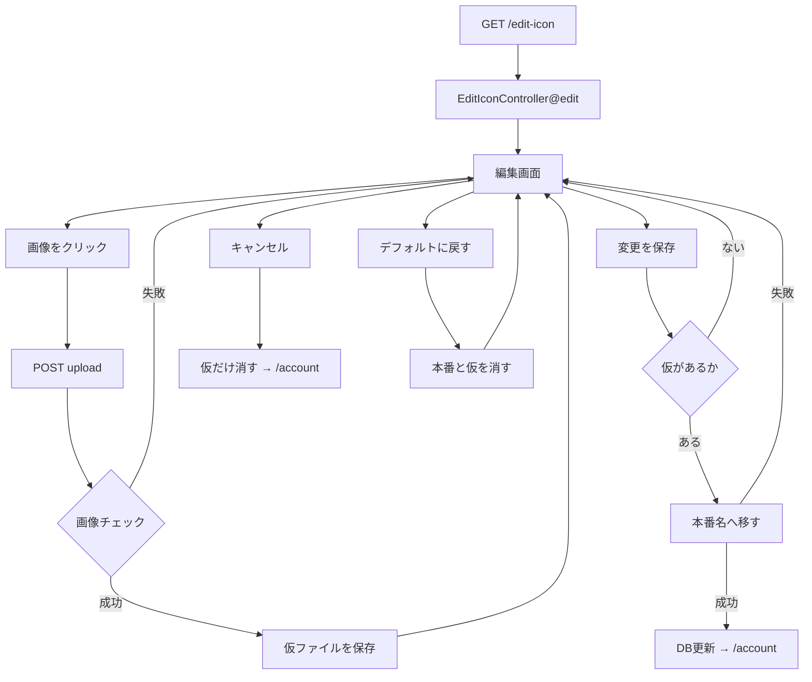
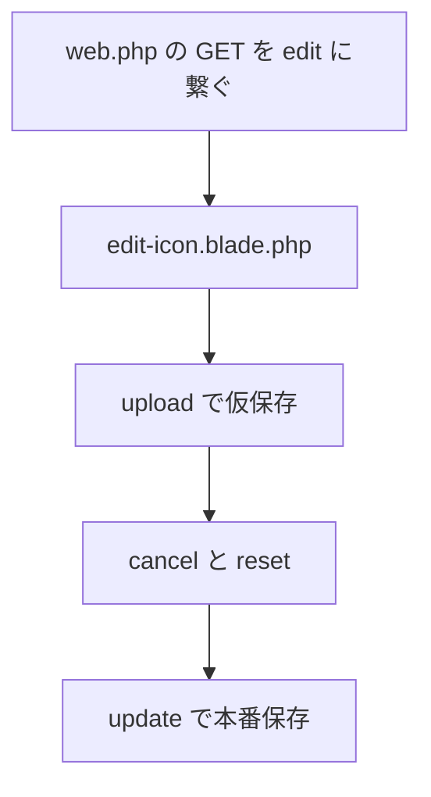

# アイコン変更実装メモ

Laravel 13 での実装。参考: [Laravel 13.x 日本語ドキュメント](https://readouble.com/laravel/13.x/ja)

---

## 処理の流れ

上の図は、アイコンを変える人が画面を操作したときの動きです。下は、その機能をファイルに書いていく順番です。

## 実装の流れ

---

## Laravel に任せて書かなくてよくなったこと

| 元で自分でやっていたこと | 楽になったこと |
|--------------------------|----------------|
| 毎回のログインチェック | ルートに認証を付けるだけ |
| 毎回の CSRF 確認 | フォームにトークンを置くだけ |
| アップロードファイルの取り出しと失敗判定 | リクエストからファイルを取る。失敗は Laravel が弾く |
| 画像の種類・サイズ・幅高さの独自チェックと、失敗時の画面戻り | バリデーション1回。失敗すると自動で編集画面へ戻り、エラー文が出る |
| フォルダ作成やファイル名の組み立て、ファイルの移動 | ストレージの保存・削除 |
| セッションからユーザーを取る | ログイン中ユーザーをそのまま使う |
| セッション上のアイコン情報を手で書き換える | DB を更新すれば、次の表示は DB を見る |
| try-catch（システムエラー） | 例外は Laravel のエラー画面。保存・移動の失敗は `withErrors` で編集画面へ |

---

## 編集画面表示

- ルート: `routes/web.php` の GET `edit-icon`。画面を出す
- コントローラー: `EditIconController.php` の `edit`
- Blade: `resources/views/edit-icon.blade.php`。仮があれば仮、なければ本番、どちらも無ければデフォルトのアイコンを表示。チェックに失敗した文も出す。ヘッダーとアカウント画面はデフォルトか本番

### 対象コミット

- 画面とルートの用意: [2cc308d](https://github.com/yumyum-02/login-laravel/commit/2cc308dd398068144fb701fd34095192836ebe4e)
- コントローラー用意: [b727069](https://github.com/yumyum-02/login-laravel/commit/b727069811fa0e6f531e9136e18507f9cfd4f0fa)
- デフォルトアイコン: [467db22](https://github.com/yumyum-02/login-laravel/commit/467db22777e90ae67322c38261bb1348b77a9551)
- GET を `edit` に繋ぐ: [a27171b](https://github.com/yumyum-02/login-laravel/commit/a27171ba493506a7702fb990f4538b64da71ff48)
- エラー一覧の見た目: [b84aa7f](https://github.com/yumyum-02/login-laravel/commit/b84aa7f7890562b783e0a82a9f78e709ce8a9744)

---

## アップロード（仮保存）

画像をクリックすると送る。仮も本番も非公開ディスク（`local` = `storage/app/private`）。画面は期限つき URL で出す。

- ルート: `routes/web.php` の POST `edit-icon/upload`
- コントローラー: `EditIconController.php` の `upload`。画像をチェックする。前の仮があれば消す。新しい仮を保存し、パスをセッションに残して編集画面へ戻る。保存に失敗したら `withErrors(['icon' => 'アイコンのアップロードに失敗しました'])` で編集画面へ戻る
- Blade: `edit-icon.blade.php` のアップロード用フォーム。戻ったあとは仮をプレビューする。エラーは `$errors->all()` で出す（欄名は `icon`）

### 対象コミット

- アップロード: [6c8f243](https://github.com/yumyum-02/login-laravel/commit/6c8f24393a55c8547230c6fb8c6f5ef874f95177)
- アップロードのルート修正: [b9e1c03](https://github.com/yumyum-02/login-laravel/commit/b9e1c0380a5fbbc58928e094ac4b3cc2e67de674)
- 古い仮アイコンを削除: [d56e31b](https://github.com/yumyum-02/login-laravel/commit/d56e31b365cf176cd3c596ea1822c2339c37a8b3)
- アップロード失敗: [0482bd5](https://github.com/yumyum-02/login-laravel/commit/0482bd5c146b3c665f3bf3a63ca9e72c1177830e)
- 非公開ディスクへ保存: [0ea2a51](https://github.com/yumyum-02/login-laravel/commit/0ea2a51dcf38799798f0fd566d061bae2c1bfb15)
- 形式チェックのメッセージ: [a350857](https://github.com/yumyum-02/login-laravel/commit/a3508574f80909c352a5a37281a936d6449897f0)

---

## キャンセル

本番のアイコンは変えない。

- ルート: `routes/web.php` の POST `edit-icon/cancel`
- コントローラー: `EditIconController.php` の `cancel`。仮があればファイルとセッションを消す。アカウント画面へ戻る
- Blade: `edit-icon.blade.php` のキャンセルボタン

### 対象コミット

- キャンセル: [2608ce5](https://github.com/yumyum-02/login-laravel/commit/2608ce536b1226924198580aa8df6e1e30becff0)

---

## デフォルトに戻す

仮と本番は別々に「あれば消す」。

`User.php` でアイコンを更新できるようにした（そうしないと DB が空にならない）。

- ルート: `routes/web.php` の POST `edit-icon/reset`
- コントローラー: `EditIconController.php` の `reset`。本番があればファイルを消して DB を空にする。仮があればファイルとセッションを消す。編集画面へ戻る
- Blade: `edit-icon.blade.php` のデフォルトに戻すボタン。戻ったあとはデフォルト画像

### 対象コミット

- デフォルトに戻す: [1730c6c](https://github.com/yumyum-02/login-laravel/commit/1730c6c6c3e8f68a64ca24607cf205000b3236f9)

---

## 変更を保存

仮が無ければ `withErrors(['icon' => '画像がアップロードされていません'])` で編集画面へ戻る。
あれば仮を `{id}_{日時}.拡張子` に移し、DB にそのパスを入れてアカウント画面へ戻る。
移せなければ DB は更新せず `withErrors(['icon' => 'アイコンの更新に失敗しました'])` で編集画面へ戻る。
古い本番ファイルは消さない。

欄名を `icon` にする。`['文章']` だけだと 0 番のエラーになり、入力チェックの `icon.required` と袋が揃わない。画面は `$errors->all()` のままで出る。

- ルート: `routes/web.php` の POST `edit-icon/update`
- コントローラー: `EditIconController.php` の `update`
- Blade: `edit-icon.blade.php` の変更を保存ボタン

### 対象コミット

- 変更を保存: [0daff25](https://github.com/yumyum-02/login-laravel/commit/0daff25103b30f2b8f8389cf1204ed3e5cfceff4)
- 保存ボタンの修正: [fcbc588](https://github.com/yumyum-02/login-laravel/commit/fcbc5880d1d9f36666d29485e92b5d0da72fa4ad)
- 編集画面とヘッダーへ反映: [fefae4a](https://github.com/yumyum-02/login-laravel/commit/fefae4af8fe93e85a53034f7f180ce4cad021a70)
- エラーの欄名を `icon` に合わせる: [733c0a7](https://github.com/yumyum-02/login-laravel/commit/733c0a76b2833b27b3a51007cb014e4b009508ac)
